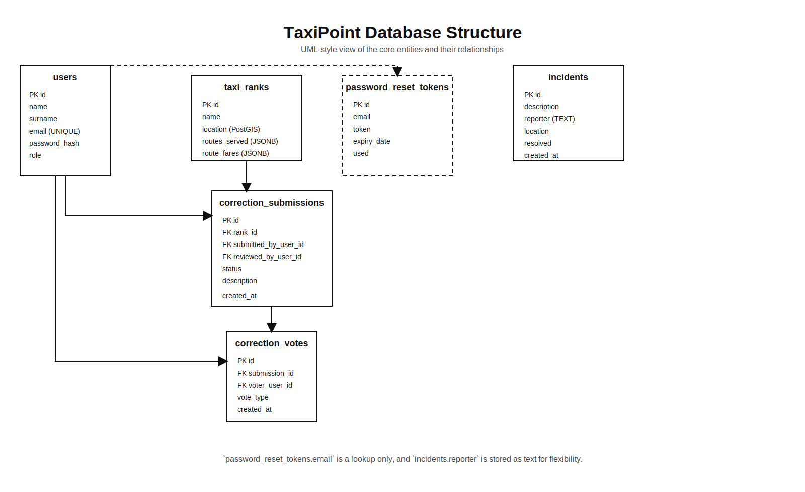

# TaxiPoint

<p align="center">
  
  
  
  
</p>
<p align="center">
  
  
  
  
</p>

---

## 1. Problem Statement

Public transport in Johannesburg, particularly minibus taxis, operates in a largely informal and fragmented ecosystem:

- Taxi rank information is not centralized
- Routes, fares, and operating hours are often unclear or outdated
- There is no real-time visibility into incidents or disruptions
- Commuters rely heavily on word-of-mouth or physical presence
- No structured way exists for users to correct inaccurate data

This results in:

- Inefficiency for commuters
- Poor decision-making
- Safety risks due to lack of real-time information

---

## 2. Solution Overview

TaxiPoint is a real-time, community-driven transport intelligence platform designed to:

- Digitize taxi rank data across Johannesburg
- Provide map-based discovery of taxi ranks and routes
- Enable real-time incident reporting
- Support crowdsourced data correction with moderation workflows
- Deliver live updates via WebSockets

The platform consists of:

- Web Application (React)
- Mobile Application (React Native / Expo)
- Backend API (Spring Boot)
- Geospatial Database (PostgreSQL + PostGIS)
- Real-time messaging layer (WebSockets)

---

## 3. Key Features

### 3.1 Taxi Rank Discovery

- Map-based visualization using geospatial queries (PostGIS)
- Rank metadata:
  - Routes served
  - Estimated fares
  - Operating hours
  - Facilities

### 3.2 Real-Time Incident Reporting

- Users can report:
  - Delays
  - Safety issues
  - Route disruptions
- Broadcast to clients via WebSockets

### 3.3 Crowdsourced Data Correction

- Users submit corrections to rank data
- Moderation workflow:
  - Submission -> Review -> Approval/Reject
- Voting system to support decision-making

### 3.4 Authentication & Security

- JWT-based authentication
- Role-based access control (RBAC)
- Secure password reset via token system

---

## 4. System Architecture

### 4.1 High-Level Architecture

```text
Client (Web / Mobile)
        |
REST API (Spring Boot)
        |
Service Layer (Business Logic)
        |
Persistence Layer (JPA)
        |
PostgreSQL + PostGIS
```

Real-time updates:

```text
Client <-> WebSocket Gateway (STOMP / SockJS)
```

---

## 5. Technology Stack

| Layer | Technology |
| --- | --- |
| Web | React, Vite, TypeScript, Tailwind CSS |
| Mobile | React Native, Expo |
| Backend | Spring Boot, Spring Security, JPA |
| Database | PostgreSQL, PostGIS, JSONB |
| Realtime | WebSockets (STOMP, SockJS) |
| Messaging | Java Mail, SendGrid |
| Auth | JWT |

---

## 6. Database Design (Production Perspective)

The system follows relational modeling principles with controlled denormalization where necessary.


### Database 


The formal ERD is available here:



### 6.1 Core Entities

- `users`
- `taxi_ranks`
- `incidents`
- `correction_submissions`
- `correction_votes`
- `password_reset_tokens`

### 6.2 Design Principles Applied

- Separation of concerns
  - Core data vs user-generated vs system tokens
- Auditability
  - `created_at`, `updated_at`, `reviewed_at`
- Soft workflows
  - Corrections stored independently before approval
- Controlled denormalization
  - Email stored alongside FK for resilience

### 6.3 Relationship Summary (Formal ERD Interpretation)

#### Strong Relationships (Foreign Keys)

- A User can submit many Correction Submissions
- A User can review many Correction Submissions
- A Taxi Rank can have many Correction Submissions
- A Correction Submission can have many Votes
- A User can cast many Votes

#### Weak / Lookup Relationships

- `password_reset_tokens.email -> users.email`
  - No FK constraint, intentional for decoupling auth flow
- `incidents.reporter`
  - Stored as text for anonymity and flexibility

### 6.4 Why This ERD is Production-Ready

- Avoids over-constraining the system
- Supports eventual consistency
- Enables moderation workflows
- Designed for high read and moderate write workloads

---

## 7. Security Considerations

- JWT authentication with expiration
- Password hashing with BCrypt
- Email-based password reset tokens
- Input validation on all endpoints
- Role-based authorization for admin actions

---

## 8. Scalability & Performance

- Connection pooling via HikariCP
- Geospatial indexing using PostGIS
- JSONB used for flexible structured data (routes, fares)
- WebSocket architecture supports real-time scaling
- Stateless backend enables horizontal scaling

---

## 9. Setup & Deployment

### Backend

```bash
cd backend/taxipoint/taxipoint
mvn clean install
mvn spring-boot:run
```

### Frontend

```bash
cd frontend/taxipoint
npm install
npm run dev
```

### Mobile

```bash
cd mobile/TaxiPoint
npm install
npx expo start
```

### Notes

- The web frontend points to the deployed backend in `frontend/taxipoint/src/config.ts`
- The mobile app points to the deployed backend and websocket URL in `mobile/TaxiPoint/config.ts`
- If you want to run locally, update those URLs before starting the apps

---

## 10. Future Improvements

- AI-based route prediction
- Fare estimation using historical data
- Offline-first mobile support
- Push notifications for incidents
- Admin analytics dashboard

---

## 11. Conclusion

TaxiPoint transforms an informal, fragmented transport system into a structured, real-time digital platform.

It demonstrates:

- Full-stack system design
- Real-time architecture
- Geospatial data handling
- Production-grade backend practices

---


